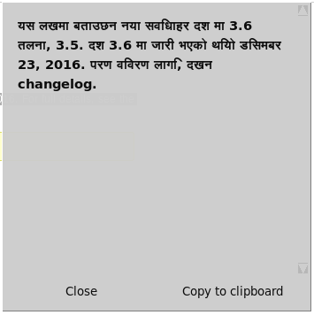

# YaTrans

## Main

**YaTrans** - The program translator in the form of pop-up notifications on the desktop. Yandex Translate technology is used (Translate API), read more here - [https://tech.yandex.com/translate/](https://tech.yandex.com/translate/)
The graphics Toolkit - tkinter.

## Configuration

The configuration file `config.json` will be automatically created when you first run, it in the directory `$HOME/.config/yatrans/`.
Settings are stored in JSON format.
Example:
```
{
        "_comment": "It is JSON config for YaTrans",
        "prilng": "en",
        "seclng": "ru",
        "color": "gray80",
        "acolor": "white",
        "timesec": 7,
        "winwidth": 350,
        "winheight": 350,
        "shiftx": 5,
        "shifty": 5,
        "font": "DejaVu Sans",
        "size": "11",
        "style": "bold",
        "cpclip": "xsel",
        "pget": "-o",
        "pset": "-ib"
}
```

- `prilng` -- the default language of the source text. Right in case if it doesn't autodetect the language.
- `seclng` -- target language.
- `color` and `acolor` -- Colors of interface components (passive and active).
- `timesec` -- time to disappear (destroy) the window.
- `winwidth` and `winheight` -- window width and height.
- `shiftx` and `shifty` -- window offset relative to the top right corner of the active display.
- `font` and `size` and `style` -- Options of the font.
- `cpclip` -- external program to work with the clipboard.
- `pget` and `pset` -- options external program to be placed in the clipboard and retrieve it.

## Image


